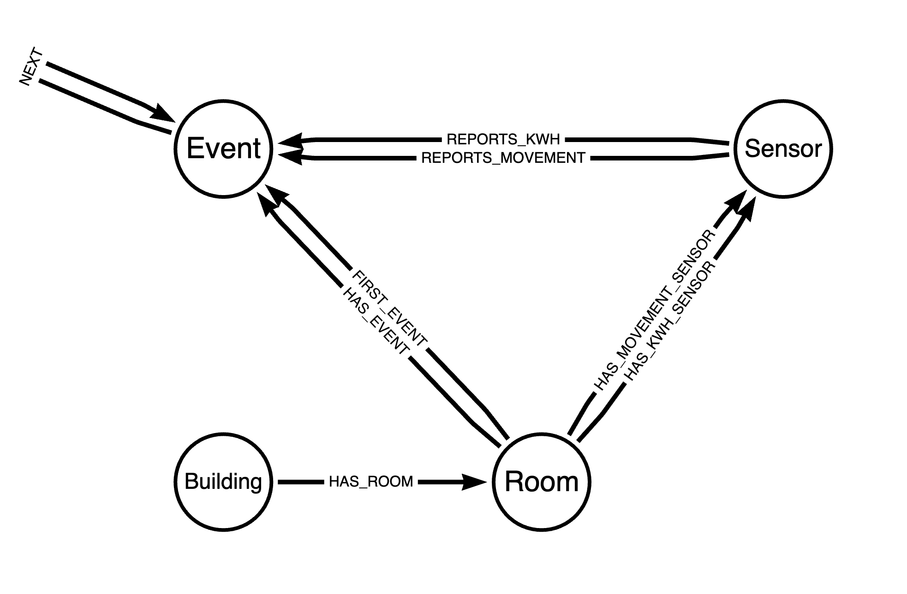

# ws001

Short temporary workshop project to load some sample data into neo4j 
Data is placed in the data directory

This is only an initial step and it is not finished, just to show the approach.

The data loaded will be using this model:


## Loading data 

Make sure you have an empty database and have the apoc library installed!

You can copy and paste the 'code' sections in the neo4j browser, make sure "Enable multi statement query editor" in the settings is checked.

### Step 1: creating constraints

Before you load data into neo4j you need to think about the constraints. Copy and paste the following into the Neo4j browser
```
CREATE CONSTRAINT ukBuilding IF NOT EXISTS FOR (n:Building) REQUIRE n.id IS UNIQUE;
CREATE CONSTRAINT ukSensor IF NOT EXISTS FOR (n:Sensor) REQUIRE n.eui IS UNIQUE;
```

### Step 2: Loading the building room and sensor structure

```
:auto LOAD CSV WITH HEADERS FROM "https://github.com/kvegter/ws001/raw/main/data/pap_villa_data.csv" as row
fieldterminator ";"
WITH row
CALL {
  with row
	MERGE (bld:Building { id : toInteger(row.villa_id) })
	MERGE (bld)-[:HAS_ROOM]->(room:Room { name : trim(row.room) })
	MERGE (kwh:Sensor:KWH { eui: row.device_eui_kwh } )
	MERGE (mvm:Sensor:Movement { eui : row.device_eui_sensor })
	MERGE (room)-[:HAS_MOVEMENT_SENSOR]->(mvm)
	MERGE (room)-[:HAS_KWH_SENSOR]->(kwh)
}
return count(row);
```

### Step 3: Loading the movement data

This can take a while!
```
:auto LOAD CSV WITH HEADERS FROM "https://github.com/kvegter/ws001/blob/main/data/pap_beweging_data.csv?raw=true" as row
fieldterminator ";"
WITH row
CALL {
   with row
MATCH (room)-[:HAS_MOVEMENT_SENSOR]->(mvm:Sensor { eui: row.device_eui } )
MERGE (room)-[r:HAS_EVENT]-(hd:Event { time: toInteger(row.tijdstip) })
ON CREATE SET hd.movement = [toInteger(row.beweging)]
, hd.date = datetime({year: toInteger(substring(row.tijdstip, 0, 4))
                   , month: toInteger(substring(row.tijdstip, 4, 2))
                   ,   day: toInteger(substring(row.tijdstip, 6, 2)) 
                   ,  hour: toInteger(substring(row.tijdstip, 8, 2)) })
ON MATCH SET hd.movement = hd.movement + [toInteger(row.beweging)] 
MERGE (mvm)-[:REPORTS_MOVEMENT]->(hd)
   return mvm, r, hd                
} IN transactions of 100 rows
return count(*) ;
```

### Step 4: loading the usage data

```
:auto LOAD CSV WITH HEADERS FROM "https://github.com/kvegter/ws001/raw/main/data/pap_verbruik_data.csv" as row
fieldterminator ";"
WITH row
CALL {
   with row
MATCH (room)-[:HAS_KWH_SENSOR]->(mvm:Sensor { eui: row.device_eui } )
MERGE (room)-[r:HAS_EVENT]->(hd:Event { time: toInteger(row.tijdstip) })
ON CREATE SET hd.usage = [toInteger(row.verbruik)]
, hd.date = datetime({year: toInteger(substring(row.tijdstip, 0, 4))
                   , month: toInteger(substring(row.tijdstip, 4, 2))
                   ,   day: toInteger(substring(row.tijdstip, 6, 2)) 
                   ,  hour: toInteger(substring(row.tijdstip, 8, 2)) })
ON MATCH SET hd.usage = CASE WHEN hd.usage is null or hd.usage = [] THEN [toInteger(row.verbruik)] ELSE  hd.usage + [toInteger(row.verbruik)]  END                 
MERGE (mvm)-[:REPORTS_KWH]->(hd)
   return mvm, r, hd                
} IN transactions of 500 rows
return count(*) ;

```

### Step 5: Loading more sensor data 

In this file also temperature, humidity, pressure and battery information is present

```
:auto LOAD CSV WITH HEADERS FROM "https://github.com/kvegter/ws001/blob/main/data/condensed_sensor_data.csv?raw=true" as row
WITH row
CALL {
   with row
MATCH (room)-[:HAS_MOVEMENT_SENSOR]->(mvm:Sensor { eui: row.eui } )
MERGE (room)-[r:HAS_EVENT]-(hd:Event { time: toInteger(row.sdate) })
ON CREATE SET hd.movement = [toInteger(row.motion)]
, hd.date = datetime({year: toInteger(substring(row.sdate, 0, 4))
                   , month: toInteger(substring(row.sdate, 4, 2))
                   ,   day: toInteger(substring(row.sdate, 6, 2)) 
                   ,  hour: toInteger(substring(row.sdate, 8, 2)) })
ON MATCH SET hd.movement = hd.movement + [toInteger(row.motion)] 
SET hd.co2 = toFloat(row.co2)
,   hd.temperature = toFloat(row.temperature)
,   hd.humidity = toFloat(row.humidity)
,   hd.pressure = toFloat(row.pressure)
,   hd.battery = toFLoat(row.battery)
MERGE (mvm)-[:REPORTS_MOVEMENT]->(hd)
   return mvm, r, hd                
} IN transactions of 500 rows
return count(*) ;
```

### Step 6: Creating NEXT relationships between room Events


```
call apoc.periodic.iterate("
MATCH (v:Building )-[:HAS_ROOM]->(room:Room )
RETURN id(room) as nid",
"  MATCH (room:Room )-->(evt:Event)  
  WHERE id(room) = nid
  WITH room, apoc.coll.sortNodes(collect(evt) ,'^time') as events where size(events) > 1
	WITH room, events, range(1,size(events) -1) as indexList 
	UNWIND indexList as index 
	WITH room, events[index -1 ] as first, events[index] as next , index
	MERGE (first)-[:NEXT]->(next)
	FOREACH (y in CASE WHEN index = 1 THEN [1] ELSE [] END |
		MERGE (room)-[:FIRST_SENSOR_DATA]->(first)
	)	
	return count(*) as nextCount
"
, { batchSize : 1 })
;
```
## Some queries

Check if we can find Rooms where there are hours with using energy to cool while there are no movements.

```
MATCH p=(e:Event)<-[:HAS_EVENT]-(r:Room)<-[:HAS_ROOM]-(b)
WHERE e.sumMovement < 1
AND e.avgUsage > 0
RETURN p
```

There are here a query to sum the usage:
```aidl
MATCH p=(e:Event)<-[:HAS_EVENT]-(r:Room)<-[:HAS_ROOM]-(b)
WHERE e.sumMovement < 1
AND e.avgUsage > 0
RETURN b.id as building, r.name AS room, sum(e.avgUsage) AS totalUsage, min(e.date) AS fromDate, max(e.date) as toDate
```

that will look like this:

|Building   | Room                              | totalUsage | fromDate           | toDate             | 
|----------|-----------------------------------|------------|--------------------|--------------------|
|104       | master sleeping room              |1245.0      |2022-02-14T15:00:00Z|2022-10-06T09:00:00Z|
|104       | guest room                        |49077.0     |2022-02-14T15:00:00Z|2022-11-25T11:00:00Z|
|127       | Master                            |2993.0      |2022-08-01T17:00:00Z|2022-10-12T07:00:00Z|
|127       | Secondary  (Guest Room) Entrance  |3343.0      |2022-08-24T18:00:00Z|2023-03-22T10:00:00Z|
|127       |Secondary  (Guest Room) third bedroom |9751.0      |2022-08-01T17:00:00Z|2023-03-26T02:00:00Z|
|121       | Master                            |6378.0      |2022-10-03T21:00:00Z|2022-11-25T07:00:00Z|
|121       | Secondary  (Guest Room) Entrance  |210.0       |2022-07-19T20:00:00Z|2022-08-01T19:00:00Z|
|121       | Secondary  (Guest Room) third bedroom |1878.0      |2022-08-14T09:00:00Z|2022-08-14T18:00:00Z|
|303       |Secondary  (Guest Room) Back of the house Right |32612.0     |2022-07-23T14:00:00Z|2023-03-28T02:00:00Z|
|303       | Secondary  (Guest Room)  Front of the house Left |297.0       |2022-08-01T18:00:00Z|2022-08-19T01:00:00Z|
